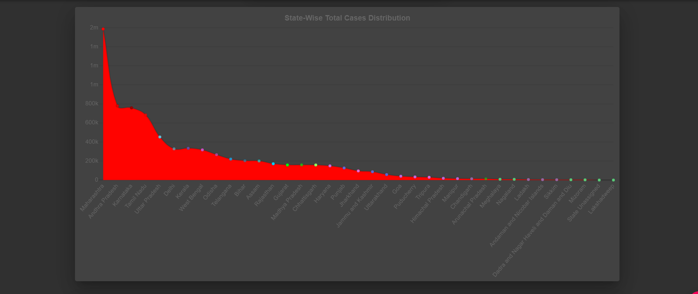

# COVID Tracker 🦠

  

## Languages and Libraries/Technologies Used 🚀

- **React.js**
- **Material UI**
- **REST API's**
- **CSS**
- **Moment.js**
- **React-chartjs-2**

## Live Link 🔗

[COVID Tracker](https://covid-19-tracker-bhargab.netlify.app/ "COVID Tracker") 👈

## ScreenShots 🖼

---

&nbsp;&nbsp;&nbsp;&nbsp;

---

&nbsp;&nbsp;&nbsp;&nbsp;

---

&nbsp;&nbsp;&nbsp;&nbsp;

---

&nbsp;&nbsp;&nbsp;&nbsp;

---

&nbsp;&nbsp;&nbsp;&nbsp;

---

&nbsp;&nbsp;&nbsp;&nbsp;

---

## Contributing 👷‍♂️

Please read [CONTRIBUTING.md](CONTRIBUTING.md) for details on our code of conduct, and the process for submitting pull requests to us.

## License 📜

Please read [LICENSE](LICENSE) for details

## Versioning 🔢

We use [SemVer](http://semver.org/) for versioning.
